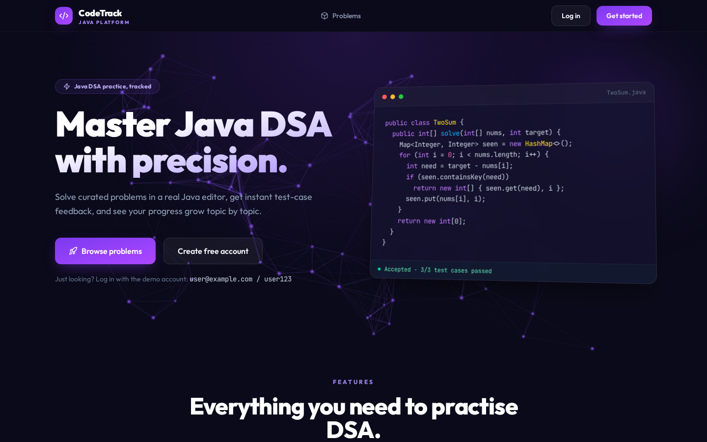
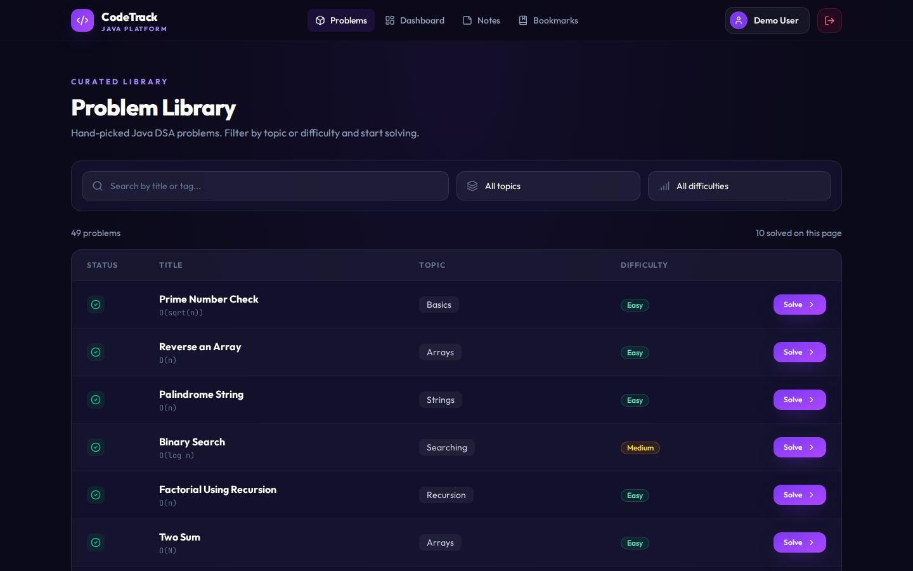
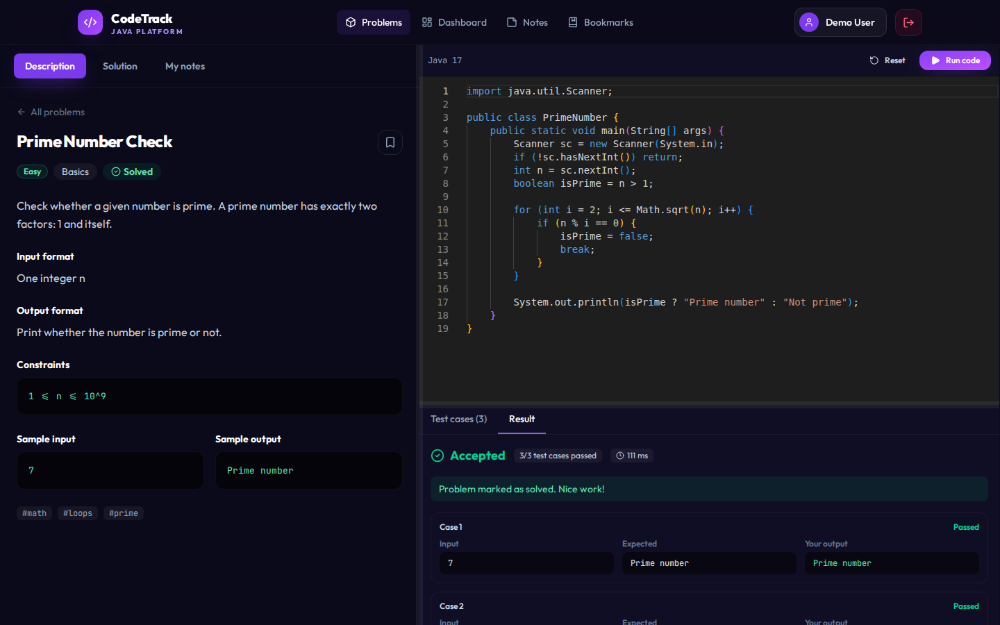
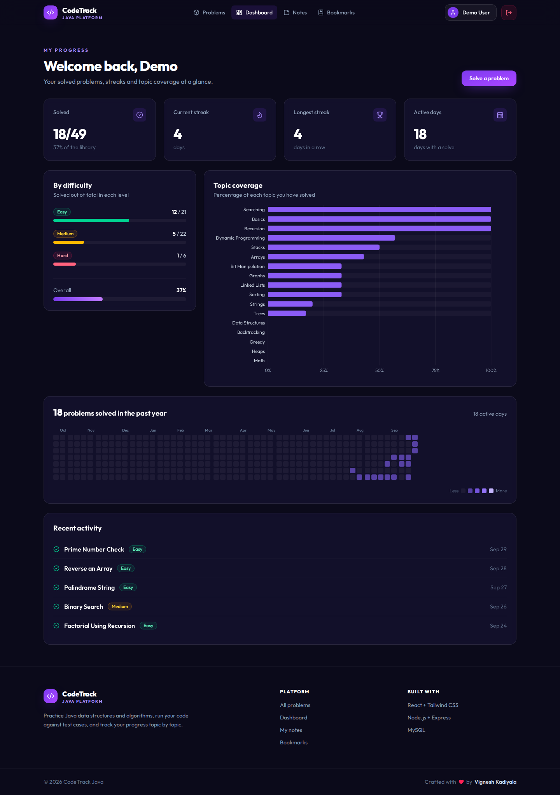
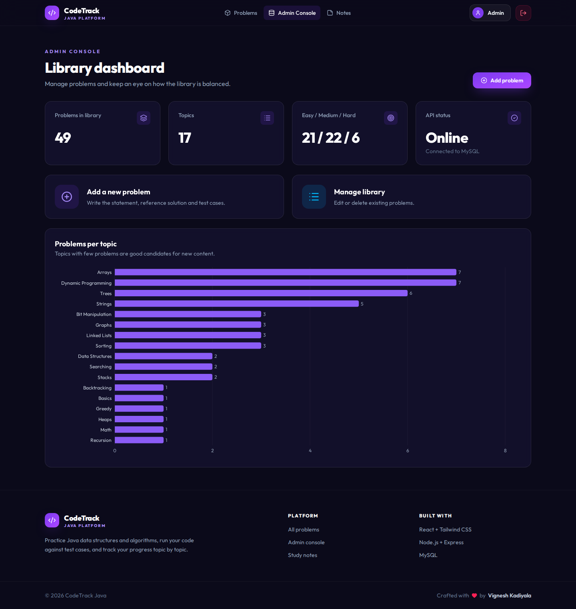
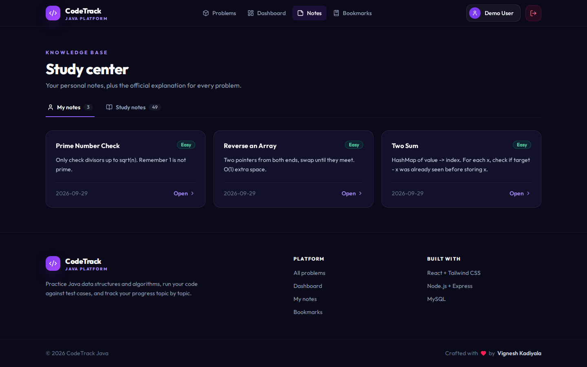
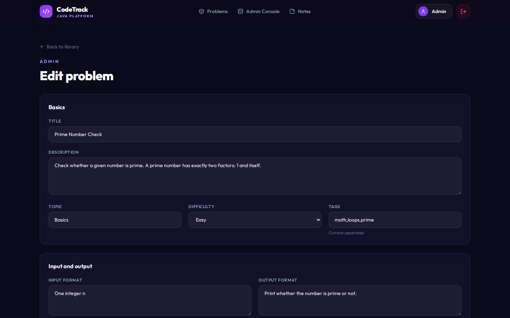
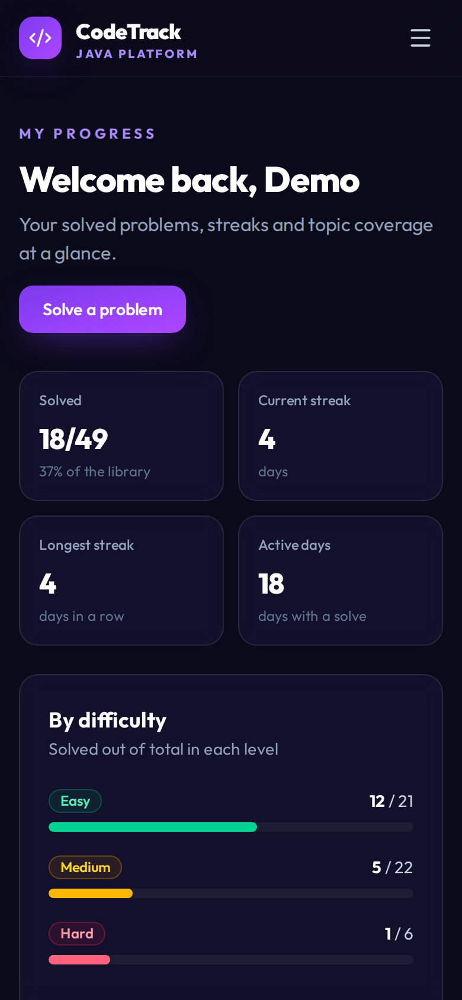

# CodeTrack Java - Java DSA Practice Tracker

**HTML · Tailwind CSS · React · Node.js/Express · MySQL**

CodeTrack is a full-stack practice platform for Java data structures and algorithms. Students solve problems in a browser code editor, the server compiles and runs their Java code against test cases, and every solve feeds a progress dashboard with topic coverage, streaks and a year-long activity heatmap. Admins manage the problem library from their own console.



## Features

- **Problem library**: about 50 seeded problems across 17 topics, with search, topic and difficulty filters and pagination (MySQL `LIMIT/OFFSET`).
- **Java code runner**: a Monaco (VS Code) editor. `POST /api/execution/run` compiles with `javac`, runs each test case with a 5-second time limit and 64 KB output cap, and returns a verdict per case.
- **Auto-grading**: passing every stored test case marks the problem as solved for the logged-in user.
- **Progress dashboard**: solved counts by difficulty, a Recharts topic-coverage chart, current and longest streak, and a GitHub-style heatmap.
- **Notes and bookmarks**: a private note per problem and a revision list.
- **Auth and roles**: JWT login, bcrypt-hashed passwords, and `USER` / `ADMIN` roles enforced by Express middleware.
- **Admin console**: add, edit and delete problems, including test cases and starter code.
- **Responsive UI**: built entirely with Tailwind CSS utilities and works down to phone width.

## Screenshots

| Problem library | Code editor with test results |
| --- | --- |
|  |  |

| Student dashboard | Admin dashboard |
| --- | --- |
|  |  |

| Study notes | Admin problem editor | Mobile |
| --- | --- | --- |
|  |  |  |

## Tech stack

| Layer | Technology |
| --- | --- |
| Markup | HTML5 (`frontend/index.html`) |
| Styling | Tailwind CSS v4 with design tokens in `@theme` (`frontend/src/index.css`) |
| Frontend | React 19, React Router 7, Vite, Recharts, Monaco Editor, Lucide icons |
| Backend | Node.js 18+, Express 4, JSON Web Tokens, bcryptjs, Helmet, express-rate-limit |
| Database | MySQL 8 via `mysql2` (connection pool, parameterised queries) |
| Code execution | JDK 17 (`javac` / `java`) run as child processes |
| Deployment | Render (Docker web service + static site), Aiven MySQL |

## Project structure

```text
CodeTrack/
├── backend/                  Node.js + Express REST API
│   ├── src/
│   │   ├── config/           env + MySQL connection pool
│   │   ├── controllers/      auth, problems, progress, notes, bookmarks, execution
│   │   ├── middleware/       JWT auth, admin guard, error handler
│   │   ├── routes/           all /api routes in one place
│   │   ├── services/         Java code runner
│   │   ├── db/setup.js       creates tables + seeds demo data
│   │   ├── data/problems.json
│   │   ├── app.js
│   │   └── server.js
│   ├── Dockerfile            Node 22 + OpenJDK 17
│   └── .env.example
├── frontend/                 React + Tailwind CSS (Vite)
│   ├── index.html
│   └── src/
│       ├── components/       Navbar, CodeEditor, ActivityHeatmap, shared UI
│       ├── pages/            Home, Problems, ProblemDetails, Dashboard, Notes...
│       ├── context/          AuthContext
│       ├── services/api.js   fetch wrapper with JWT
│       └── index.css         Tailwind import + theme tokens
├── database/schema.sql       MySQL tables, keys and indexes
├── render.yaml               one-click Render Blueprint
└── docs/screenshots/
```

## Database schema

Five InnoDB tables, all `utf8mb4`:

- `users`: name, unique email, bcrypt hash, `ENUM('USER','ADMIN')` role
- `problems`: statement, difficulty `ENUM`, tags, reference solution, starter code, `test_cases_json`, complexities, indexed on category and difficulty
- `user_progress`, `notes`, `bookmarks`: one row per user and problem (`UNIQUE(user_id, problem_id)`), with foreign keys that `ON DELETE CASCADE`

Upserts use `INSERT ... ON DUPLICATE KEY UPDATE`, and the dashboard statistics are computed with SQL `GROUP BY` aggregates. See [`database/schema.sql`](database/schema.sql).

## Run locally

**Requirements:** Node.js 18+, MySQL 8 (or MariaDB 10.6+), and JDK 17+ (`javac` on your PATH) for the code runner.

### 1. Backend

```bash
cd backend
cp .env.example .env        # then set DB_USER / DB_PASSWORD
npm install
npm run dev                 # http://localhost:8080
```

On first start the API creates the `codetrack_java` database and tables, then seeds the problems and two demo accounts. No manual SQL is needed.

### 2. Frontend

```bash
cd frontend
cp .env.example .env        # VITE_API_BASE_URL=http://localhost:8080/api
npm install
npm run dev                 # http://localhost:5173
```

### Demo accounts

| Role | Email | Password |
| --- | --- | --- |
| Student | `user@example.com` | `user123` |
| Admin | `admin@example.com` | `admin123` |

The student account comes with some solved problems, notes and bookmarks so the dashboard isn't empty.

## API reference

All routes are prefixed with `/api`. 🔒 = requires `Authorization: Bearer <token>`; 👑 = admin only.

| Method | Route | Description |
| --- | --- | --- |
| POST | `/auth/register` | Create an account and return a JWT |
| POST | `/auth/login` | Log in and return a JWT |
| GET | `/auth/profile` 🔒 | Profile with solved, notes and bookmark counts |
| GET | `/problems?q=&category=&difficulty=&page=&size=` | Paginated, filterable list |
| GET | `/problems/categories` | Distinct topics |
| GET | `/problems/:id` | One problem, with test cases and starter code |
| POST / PUT / DELETE | `/problems[/:id]` 🔒👑 | Create, update or delete a problem |
| POST | `/progress/solved/:problemId` 🔒 | Mark as solved |
| GET | `/progress/solved-ids` 🔒 | IDs of solved problems |
| GET | `/progress/stats` 🔒 | Dashboard statistics |
| GET / POST / DELETE | `/notes[/:problemId]` 🔒 | Personal notes |
| GET / POST / DELETE | `/bookmarks[/:problemId]`, `/bookmarks/ids` 🔒 | Revision bookmarks |
| POST | `/execution/run` | `{ code, problemId?, input? }` compiles and runs Java |
| GET | `/health` | API and database status |

## Deployment (Render + Aiven MySQL)

1. **Database:** create a free MySQL service on [Aiven](https://aiven.io) and note the host, port, user and password. The database is `defaultdb`.
2. **Backend:** on Render, create a **Web Service** from this repo:
   - Runtime **Docker**, Dockerfile path `./backend/Dockerfile`, Docker context `.`
   - Environment: `DB_HOST`, `DB_PORT`, `DB_USER`, `DB_PASSWORD`, `DB_NAME=defaultdb`, `DB_SSL=true`, `JWT_SECRET` (long random string), `CLIENT_ORIGIN=<frontend URL>`
   - Health check path `/api/health`
3. **Frontend:** create a **Static Site** from this repo:
   - Build command `cd frontend && npm ci && npm run build`, publish directory `frontend/dist`
   - Environment: `VITE_API_BASE_URL=https://<your-api>.onrender.com/api`
   - Under **Redirects/Rewrites**, add a rewrite from `/*` to `/index.html` so React Router deep links work.

Alternatively, use **New → Blueprint** in Render, which reads [`render.yaml`](render.yaml) and sets up both services.

> Render's free tier sleeps after 15 minutes of inactivity, so the first request after a pause can take about 30-50 seconds.

## Security notes

- Passwords are hashed with bcrypt, and JWTs expire after one day by default.
- Every SQL query uses placeholders, never string concatenation.
- Helmet sets security headers, CORS only allows the configured frontend, and login, register and code execution are rate limited.
- The code runner uses a time limit, a memory cap (`-Xmx128m`), an output cap and a stripped environment. It is **not** a full sandbox: for a public production service, run each submission in an isolated container (for example Docker with no network and CPU/memory limits).

## Future enhancements

- Test cases for every seeded problem (3 have them today)
- Containerised sandbox per submission
- Submission history and leaderboard
- Discussion thread per problem

---

Crafted by **Vignesh Kadiyala**
