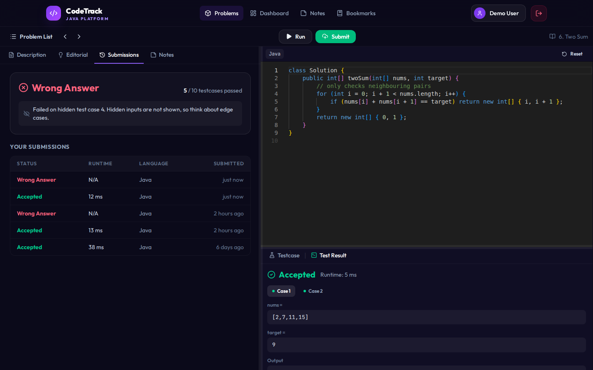
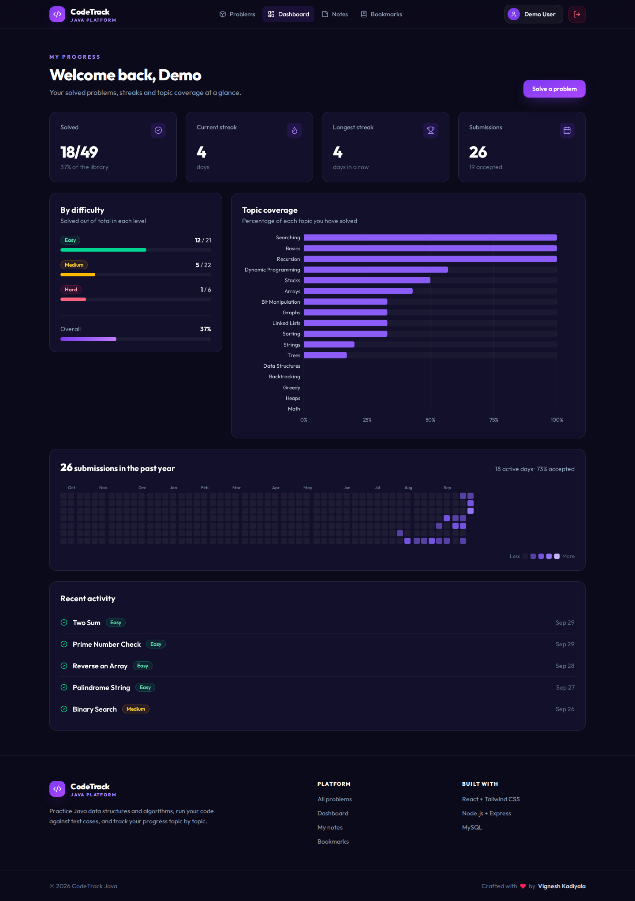
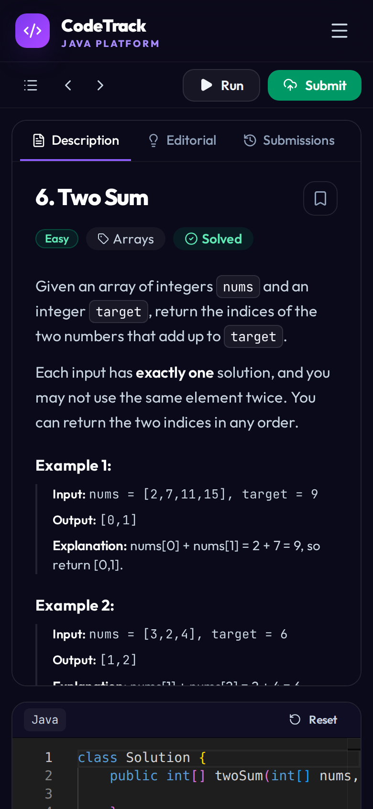

# CodeTrack Java - Java DSA Practice Tracker

**HTML · Tailwind CSS · React · Node.js/Express · MySQL**

CodeTrack is a full-stack practice platform for Java data structures and algorithms. Students solve problems in a browser code editor, the server compiles and runs their Java code against test cases, and every solve feeds a progress dashboard with topic coverage, streaks and a year-long activity heatmap. Admins manage the problem library from their own console.


## Features

- **LeetCode-style problems**: 49 Java DSA problems across 17 topics. You write a method inside `class Solution` (or a design class like `LRUCache`), and a hidden driver handles input and output.
- **Hidden test cases**: every problem has 2 visible examples plus 4 to 16 hidden tests with edge cases and larger inputs: 458 tests in total, 360 of them hidden. Hidden inputs never leave the server.
- **Run and Submit**: *Run* checks your code on the examples or on your own custom test cases (expected output comes from the reference solution). *Submit* judges every test and reports **Accepted, Wrong Answer, Runtime Error, Time Limit Exceeded or Compilation Error**, with runtime and the percentage of accepted solutions you beat.
- **Fast single-JVM judge**: each submission is compiled in-process and all of its test cases run inside one JVM, each with a fresh class loader, a CPU-time limit, an output cap and a sandbox that blocks file writes, process launches, network access and `System.exit`.
- **Submissions history**: every submission is saved with its verdict, runtime and code, and you can load any past submission back into the editor.
- **Problem list**: numbered problems with acceptance rate, Solved and Attempted status, a solved-by-difficulty summary, search, filters and a **Pick One** button.
- **Workspace**: resizable Description, Editorial, Submissions and Notes tabs, a Monaco (VS Code) editor, editable test cases, keyboard shortcuts (Ctrl + ' to run, Ctrl + Enter to submit) and auto-saved drafts.
- **Progress dashboard**: solved counts by difficulty, topic coverage, streaks and a GitHub-style heatmap of submissions.
- **Login-protected workspace**: anyone can browse the library, but opening a problem needs an account. Guests are sent to the login page and returned to the same problem afterwards.
- **Admin console**: add or edit problems, including hidden and visible test cases, driver code and starter code, with a button that fills in expected outputs from the reference solution.
- **Auth and roles**: JWT login, bcrypt-hashed passwords, and `USER` / `ADMIN` roles.
- **Responsive UI** built entirely with Tailwind CSS.

## Screenshots

| Problem list | Workspace after an accepted submission |
| --- | --- |
|  |  |

| Failing a hidden test | Student dashboard |
| --- | --- |
|  |  |

| Admin dashboard | Admin problem editor | Mobile |
| --- | --- | --- |
|  |  |  |

## Tech stack

| Layer | Technology |
| --- | --- |
| Markup | HTML5 (`frontend/index.html`) |
| Styling | Tailwind CSS v4 with design tokens in `@theme` (`frontend/src/index.css`) |
| Frontend | React 19, React Router 7, Vite, Recharts, Monaco Editor, Lucide icons |
| Backend | Node.js 18+, Express 4, JSON Web Tokens, bcryptjs, Helmet, express-rate-limit |
| Database | MySQL 8 via `mysql2` (connection pool, parameterised queries) |
| Judge | JDK 17: in-process compilation (`javax.tools`) and a single-JVM test runner |
| Deployment | Render (Docker web service + static site), Aiven MySQL |

## Project structure

```text
CodeTrack/
├── backend/                  Node.js + Express REST API
│   ├── judge/                Java judge (CodeTrackJudge) + ListNode, TreeNode, CodeTrackIO
│   ├── tools/problem-bank/   problem definitions, generators and the verifier that builds problems.json
│   ├── src/
│   │   ├── config/           env + MySQL connection pool
│   │   ├── controllers/      auth, problems, progress, notes, bookmarks, execution
│   │   ├── middleware/       JWT auth, admin guard, error handler
│   │   ├── routes/           all /api routes in one place
│   │   ├── services/         judge.js (runs the Java judge)
│   │   ├── db/setup.js       creates tables + seeds demo data
│   │   ├── data/problems.json
│   │   ├── app.js
│   │   └── server.js
│   ├── Dockerfile            Node 22 + OpenJDK 17
│   └── .env.example
├── frontend/                 React + Tailwind CSS (Vite)
│   ├── index.html
│   └── src/
│       ├── components/       Navbar, workspace panels, ActivityHeatmap, shared UI
│       ├── pages/            Home, Problems, ProblemWorkspace, Dashboard, Notes...
│       ├── context/          AuthContext
│       ├── services/api.js   fetch wrapper with JWT
│       └── index.css         Tailwind import + theme tokens
├── database/schema.sql       MySQL tables, keys and indexes
├── render.yaml               one-click Render Blueprint
└── docs/screenshots/
```

## Database schema

Seven InnoDB tables, all `utf8mb4`:

- `users`: name, unique email, bcrypt hash, `ENUM('USER','ADMIN')` role
- `problems`: statement, difficulty `ENUM`, tags, reference solution, starter code, hidden driver code, parameter names, `test_cases_json` (visible and hidden tests), complexities
- `submissions`: every judged submission with verdict, passed/total tests, runtime and code
- `app_meta`: the version of the built-in problem bank, so new or updated problems sync automatically on deploy
- `user_progress`, `notes`, `bookmarks`: one row per user and problem (`UNIQUE(user_id, problem_id)`), with foreign keys that `ON DELETE CASCADE`

Upserts use `INSERT ... ON DUPLICATE KEY UPDATE`, and the dashboard statistics are computed with SQL `GROUP BY` aggregates. See [`database/schema.sql`](database/schema.sql).

## Run locally

**Requirements:** Node.js 18+, MySQL 8 (or MariaDB 10.6+), and JDK 17+ (`javac` on your PATH) for the code runner.

### 1. Backend

```bash
cd backend
cp .env.example .env        # then set DB_USER / DB_PASSWORD
npm install
npm run dev                 # http://localhost:8080
```

On first start the API creates the `codetrack_java` database and tables, then seeds the problems and two demo accounts. No manual SQL is needed.

### 2. Frontend

```bash
cd frontend
cp .env.example .env        # VITE_API_BASE_URL=http://localhost:8080/api
npm install
npm run dev                 # http://localhost:5173
```

### Demo accounts

| Role | Email | Password |
| --- | --- | --- |
| Student | `user@example.com` | `user123` |
| Admin | `admin@example.com` | `admin123` |

The student account comes with some solved problems, notes and bookmarks so the dashboard isn't empty.

## API reference

All routes are prefixed with `/api`. 🔒 = requires `Authorization: Bearer <token>`; 👑 = admin only.

| Method | Route | Description |
| --- | --- | --- |
| POST | `/auth/register`, `/auth/login` | Create an account or log in; returns a JWT |
| GET | `/auth/profile` 🔒 | Profile with solved, notes and bookmark counts |
| GET | `/problems?q=&category=&difficulty=&page=&size=` | Paginated, filterable list with acceptance rates |
| GET | `/problems/categories`, `/problems/random` | Topics; a random problem id |
| GET | `/problems/:id` | Statement, examples and stats (admins also get hidden tests and the driver) |
| POST / PUT / DELETE | `/problems[/:id]` 🔒👑 | Create, update or delete a problem |
| POST | `/execution/run` 🔒 | `{ problemId, code, inputs? }` runs the examples or custom inputs |
| POST | `/submissions` 🔒 | `{ problemId, code }` judges every test case and saves the verdict |
| GET | `/submissions?problemId=`, `/submissions/:id` 🔒 | Your submission history, or one submission with its code |
| POST | `/execution/expected` 🔒👑 | Expected outputs for new test inputs, from the reference solution |
| GET | `/progress/stats`, `/progress/statuses`, `/progress/solved-ids` 🔒 | Dashboard statistics, Solved and Attempted ids |
| GET / POST / DELETE | `/notes[/:problemId]` 🔒 | Personal notes |
| GET / POST / DELETE | `/bookmarks[/:problemId]`, `/bookmarks/ids` 🔒 | Revision bookmarks |
| GET | `/health` | API and database status |

## How the judge works

1. The API writes your code, the problem's hidden `CodeTrackDriver` and the test inputs to a temporary folder.
2. It starts **one** JVM running `CodeTrackJudge`, which compiles everything in-process with `javax.tools`.
3. Each test case runs in a fresh class loader (so `static` fields reset), with its own stdin and stdout, a 2-second CPU limit and a 64 KB output cap. The driver parses the input, calls your method and records the result, so your own `System.out.println` debugging shows up separately as *Stdout*.
4. Results come back as JSON lines. The API compares them with the expected outputs and never sends hidden inputs to the browser.

The problem bank lives in `backend/tools/problem-bank/`. `python3 build.py` runs every reference solution through the real judge, checks each answer against an independent Python solution, and writes `backend/src/data/problems.json`. On startup the API syncs any changed built-in problems into MySQL. Problems an admin has edited are left alone.

## Deployment (Render + Aiven MySQL)

1. **Database:** create a free MySQL service on [Aiven](https://aiven.io) and note the host, port, user and password. The database is `defaultdb`.
2. **Backend:** on Render, create a **Web Service** from this repo:
   - Runtime **Docker**, Dockerfile path `./backend/Dockerfile`, Docker context `.`
   - Environment: `DB_HOST`, `DB_PORT`, `DB_USER`, `DB_PASSWORD`, `DB_NAME=defaultdb`, `DB_SSL=true`, `DB_TIMEZONE=+05:30`, `JWT_SECRET` (long random string), `CLIENT_ORIGIN=<frontend URL>`
   - Health check path `/api/health`
3. **Frontend:** create a **Static Site** from this repo:
   - Build command `cd frontend && npm ci && npm run build`, publish directory `frontend/dist`
   - Environment: `VITE_API_BASE_URL=https://<your-api>.onrender.com/api`
   - Under **Redirects/Rewrites**, add a rewrite from `/*` to `/index.html` so React Router deep links work.

Alternatively, use **New → Blueprint** in Render, which reads [`render.yaml`](render.yaml) and sets up both services.

> Render's free tier sleeps after 15 minutes of inactivity, so the first request after a pause can take about 30-50 seconds.

## Security notes

- Passwords are hashed with bcrypt, and JWTs expire after one day by default.
- Every SQL query uses placeholders, never string concatenation.
- Helmet sets security headers, CORS only allows the configured frontend, and login, register and code execution are rate limited.
- The judge enforces CPU-time, memory (`-Xmx256m`) and output limits, runs with a stripped environment, and blocks file writes, process launches, network access and `System.exit` from submitted code. Submissions are judged one at a time (`JUDGE_CONCURRENCY`) and rate-limited per user. For a large public service, also run the judge in a separate container with no network.

## Future enhancements

- More languages (Python, C++)
- Contests and a leaderboard
- Discussion thread per problem

---

Crafted by **Vignesh Kadiyala**
